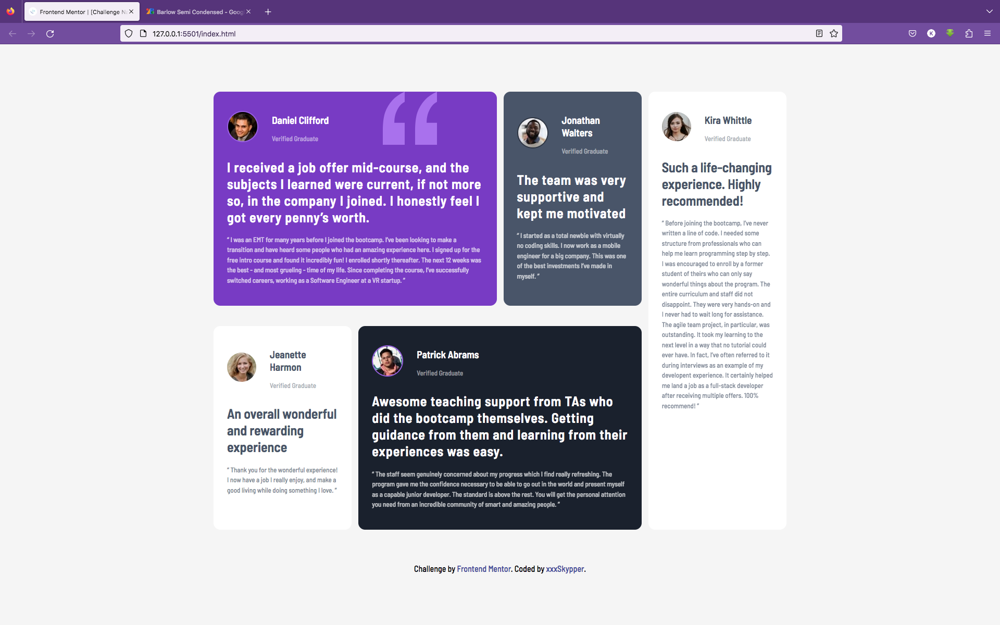
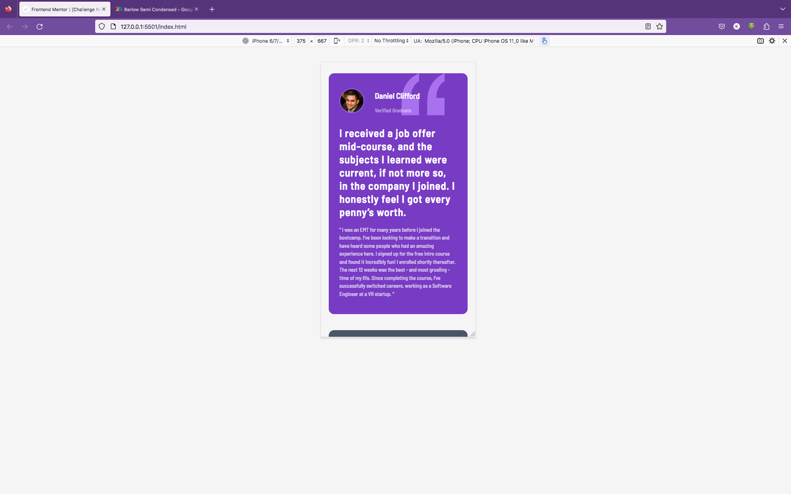
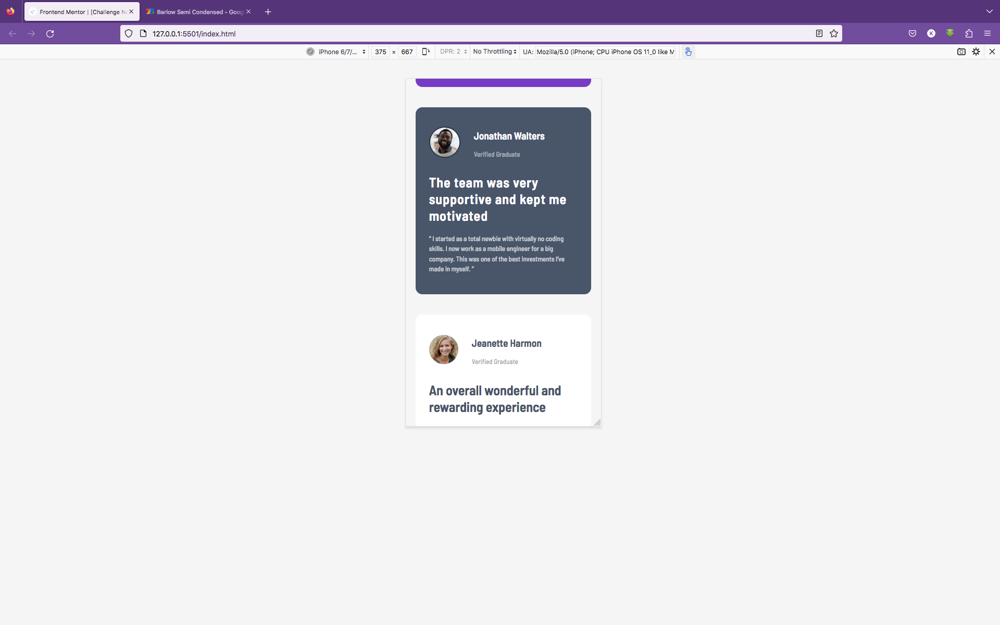
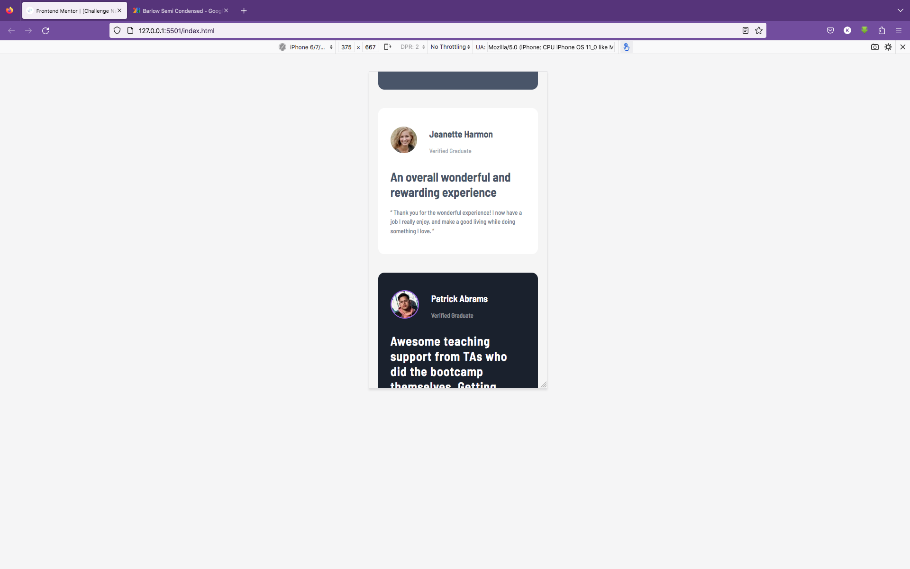
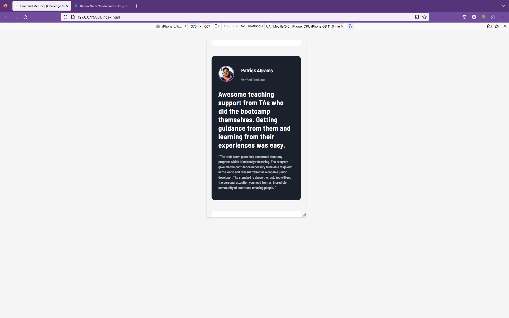
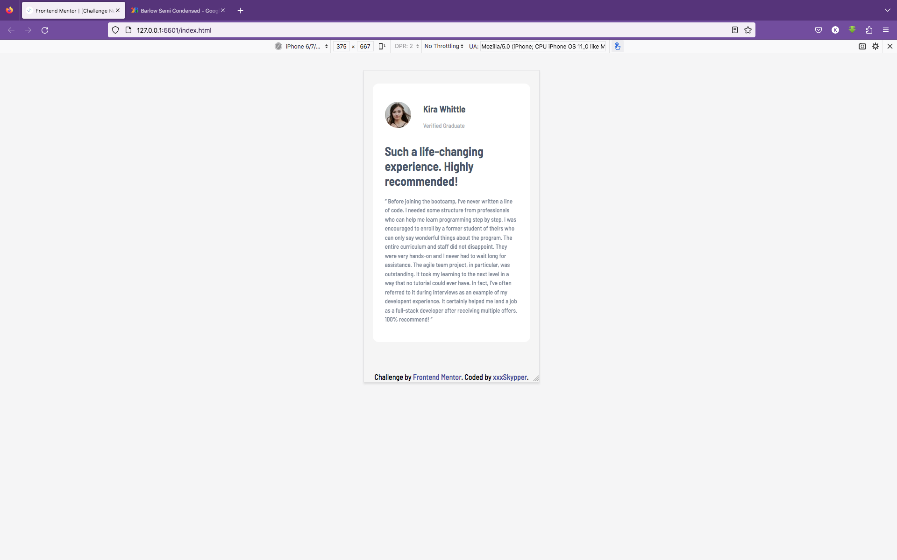

# Frontend Mentor - Testimonials grid section solution

This is a solution to the [Testimonials grid section challenge on Frontend Mentor](https://www.frontendmentor.io/challenges/testimonials-grid-section-Nnw6J7Un7). Frontend Mentor challenges help you improve your coding skills by building realistic projects. 

## Table of contents

- [Overview](#overview)
  - [The challenge](#the-challenge)
  - [Screenshot](#screenshot)
  - [Links](#links)
- [Author](#author)

## Overview

### The challenge

Users should be able to:

- View the optimal layout for the site depending on their device's screen size

### Screenshot

### Links

- Solution URL: [xxxSkypper](https://github.com/xxxSkypper)
- Live Site URL: [vercel](https://testimonials-grid-section-master-fvjeve22c-xxxskypper.vercel.app/)

### Built with

- Semantic HTML5 markup
- CSS custom properties
- Flexbox
- CSS Grid
- Mobile-first workflow

## Author

- Website - [xxxSkypper](https://www.github.com/xxxSkypper)
- Frontend Mentor - [@xxxSkypper](https://www.frontendmentor.io/profile/xxxSkypper)
- Twitter - [@xxx_Skypper](https://www.twitter.com/xxx_Skypper)

